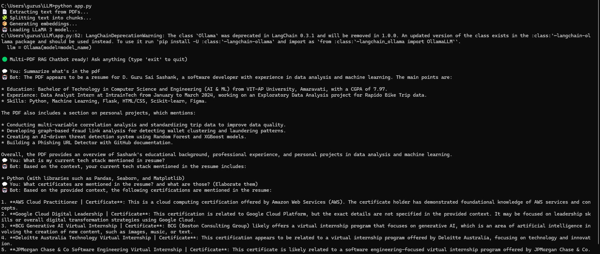

# 🧠 Multi-PDF RAG Chatbot using LLaMA 3

This project is a local **RAG (Retrieval-Augmented Generation)** chatbot that can read and answer questions from multiple PDF files using **LLaMA 3** running on **Ollama**, without needing OpenAI API keys.

---

## ✅ Features

- 📄 Accepts multiple PDFs as knowledge base
- 🧩 Splits text into chunks for better context handling
- 📦 Uses FAISS for vector storage and semantic retrieval
- 🤖 Uses local **LLaMA 3** model for inference via **Ollama**
- 🔁 Chat loop interface to interact with the data

---

## 🛠️ Tech Stack

- Python
- LangChain
- Ollama (LLaMA 3)
- FAISS
- PyMuPDF
- dotenv

---

## 🧪 How to Run

1. **Install Ollama & pull model**
   ```
   ollama run llama3
   ```

2. **Install dependencies**
   ```
   pip install -r requirements.txt
   ```

3. **Add PDF files to `data/` folder**
   ```
   📁 data/
   ├── resume.pdf
   └── data.pdf
   ```

4. **Run the chatbot**
   ```
   python app.py
   ```

---

## 🖼️ Sample Output



---

## 🚀 Future Enhancements

- Build a **web-based interface** using Streamlit or Flask
- Add a **file upload** feature for dynamic PDF processing
- Integrate **embedding caching** to avoid recomputation
- Optionally serve as a **local personal assistant bot**

---

## 🧠 Credits

- Built using [LangChain](https://github.com/langchain-ai/langchain)
- Embeddings and LLMs via [Ollama](https://ollama.com)

